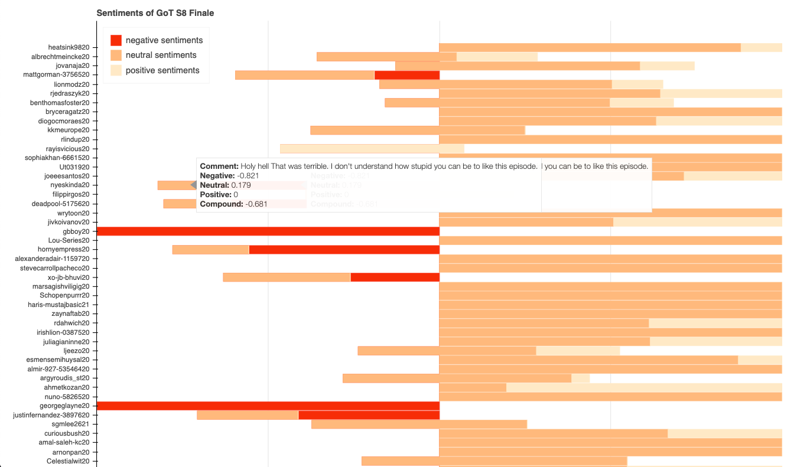

### Sentiment Analysis ###

[VaderSentiment](https://github.com/cjhutto/vaderSentiment)

[Bokeh](https://bokeh.pydata.org/en/latest/)

[spaCy](https://spacy.io/models/en)

[Pandas](http://pandas.pydata.org/)

[Flask](http://flask.pocoo.org/)

### Usage: ###

##### Activate environment #####
```$ source bin/activate ```

##### Install requirements #####
```$ pip install -r requirements.txt```

##### Update dictionary #####
```$ python -m spacy download en_core_web_sm```  
```$ python -m spacy download en_core_web_md```  
```$ python -m spacy download en_core_web_lg```  

##### Run app #####
```$ python gots8sentimentAnalysis.py```

##### Snapshot Capture #####


##### Run Flask Server: #####
```$ FLASK_APP=app.py flask run```

```$ curl http://localhost:5000 --header "Content-Type: application/json" --data "I love applesauce!"```  

Expected: ```[{"compound": 0.0, "neg": 0.0, "neu": 0.0, "pos": 0.0}, {"compound": -0.5719, "neg": 0.787, "neu": 0.213, "pos": 0.0}]```

You can also use Postman if you like.

Note: not all the modules in requirements.txt is necessary, only whatever is stated in this README.md file.

